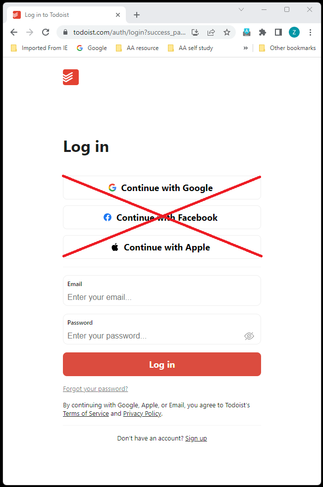
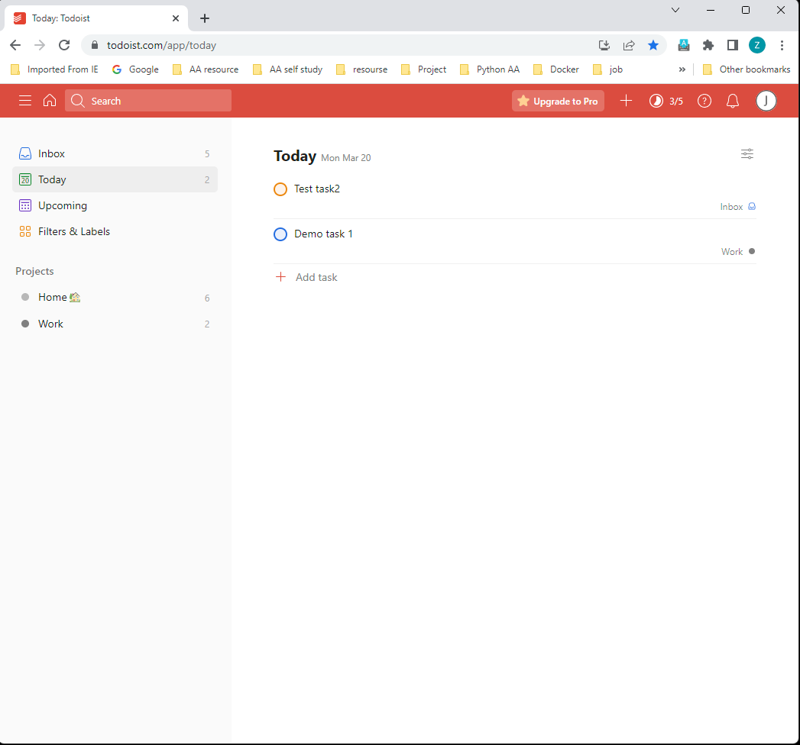

# Flask React Project

<a name="readme-top"></a>

<br />
<div align="center">
  <a href="https://github.com/James7z/my-todo-list.git">
    <!--  -->
  </a>

<h3 align="center">MyTodoList</h3>

  <p align="center">
    A clone of the popular Tumblr web application. Scrollr is a place to share ideas and opinions with others. You are able to post, comment and  even follow other users.
    <br />
    <a href="https://github.com/James7z/my-todo-list.git"><strong>Explore the docs »</strong></a>
    <br />
    <br />
    <!-- <a href="https://github.com/James7z/my-todo-list.git/issues">Report Bug</a>
    ·
    <a href="https://github.com/James7z/my-todo-list.git/issues">Request Feature</a> -->
  </p>
</div>


<details>
  <summary>Table of Contents</summary>
  <ol>
    <li>
      <a href="#about-the-project">About The Project</a>
      <ul>
        <li><a href="#built-with">Built With</a></li>
      </ul>
    </li>
    <li>
      <a href="#getting-started">Getting Started</a>
      <ul>
        <li><a href="#prerequisites">Prerequisites</a></li>
        <li><a href="#installation">Installation</a></li>
      </ul>
    </li>
    <li><a href="#usage">Usage</a></li>
    <li><a href="#roadmap">Roadmap</a></li>
    <li><a href="#contributing">Contributing</a></li>
    <li><a href="#license">License</a></li>
    <li><a href="#contact">Contact</a></li>
    <li><a href="#acknowledgments">Acknowledgments</a></li>
  </ol>
</details>


## About The Project
'A clone of the popular to-do list application Totoist. MyTodoList is a app to help you organize your work and life.'

<p align="right">(<a href="#readme-top">back to top</a>)</p>


### Built With


* React
* JavaScript
* Python
* HTML
* CSS
* Flask


<p align="right">(<a href="#readme-top">back to top</a>)</p>


## Getting started


1. Clone this repository (only this branch)

2. Install dependencies

      ```bash
      pipenv install -r requirements.txt
      ```

3. Create a **.env** file based on the example with proper settings for your
   development environment

4. Make sure the SQLite3 database connection URL is in the **.env** file

5. This starter organizes all tables inside the `flask_schema` schema, defined
   by the `SCHEMA` environment variable.  Replace the value for
   `SCHEMA` with a unique name, **making sure you use the snake_case
   convention**.

6. Get into your pipenv, migrate your database, seed your database, and run your Flask app

   ```bash
   pipenv shell
   ```

   ```bash
   flask db upgrade
   ```

   ```bash
   flask seed all
   ```

   ```bash
   flask run
   ```

7. To run the React App in development, checkout the [README](./react-app/README.md) inside the `react-app` directory.


<p align="right">(<a href="#readme-top">back to top</a>)</p>


## Usage



Create your account with secure hashed password protection.



The home page displays the to-do tasks.


You can create new task.


You can check you task as it has been done. And you can also may update or delete your task.


You may comment your task.


You can create a project to organize your tasks


You can creat labels to help you organize your tasks

<p align="right">(<a href="#readme-top">back to top</a>)</p>


## Roadmap

- [ ] Tasks
- [ ] Projecs
- [ ] Comments
- [ ] Labels


See the [open issues](https://github.com/NRH-AA/Python_Project.git/issues) for a full list of proposed features (and known issues).

<p align="right">(<a href="#readme-top">back to top</a>)</p>


## Contributing

Contributions are what make the open source community such an amazing place to learn, inspire, and create. Any contributions you make are **greatly appreciated**.

If you have a suggestion that would make this better, please fork the repo and create a pull request. You can also simply open an issue with the tag "enhancement".
Don't forget to give the project a star! Thanks again!

1. Fork the Project
2. Create your Feature Branch (`git checkout -b feature/AmazingFeature`)
3. Commit your Changes (`git commit -m 'Add some AmazingFeature'`)
4. Push to the Branch (`git push origin feature/AmazingFeature`)
5. Open a Pull Request

<p align="right">(<a href="#readme-top">back to top</a>)</p>


<p align="right">(<a href="#readme-top">back to top</a>)</p>


## Contact
<pre>
James -
</pre>
Project Link: [https://github.com/James7z/my-todo-list.git](https://github.com/NRH-AA/Python_Project.git)

<p align="right">(<a href="#readme-top">back to top</a>)</p>


<p align="right">(<a href="#readme-top">back to top</a>)</p>

[React.js]: https://img.shields.io/badge/React-20232A?style=for-the-badge&logo=react&logoColor=61DAFB
[React-url]: https://reactjs.org/
